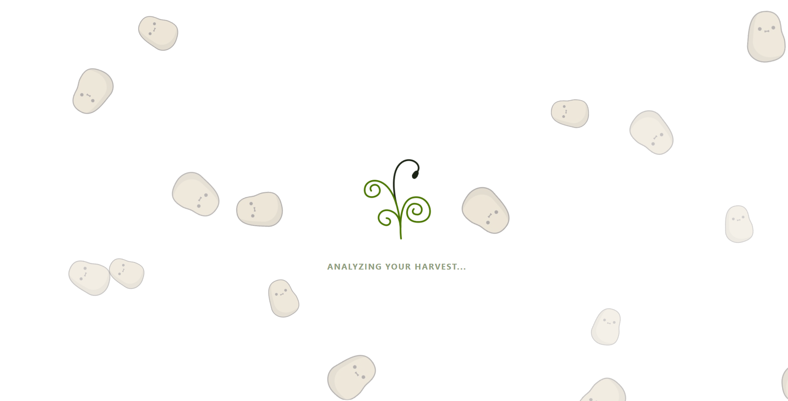
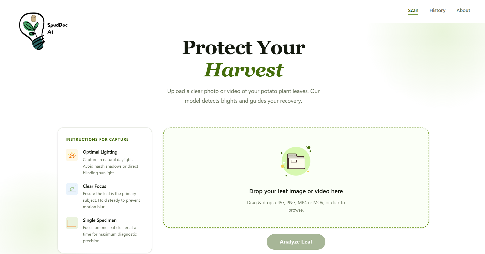

  

# SpudDoc AI

> An automated potato leaf disease detection system powered by deep learning, built to protect Nepal's harvest.

&nbsp;

## App Preview

| Landing Page | Analyzing Screen |
|:-:|:-:|
|  |  |

&nbsp;

## Project Overview

**SpudDoc AI** is a computer vision application developed for **CT6057NI Computer Vision** (Autumn Semester 2026) to address real agricultural challenges faced by Nepali farming communities.

The system allows users to scan their potato plant leaves and receive an instant health diagnosis, detecting **Early Blight**, **Late Blight**, or confirming a **Healthy** status, along with actionable recovery guidance.

### Why This Matters
- Late Blight (*Phytophthora infestans*) devastates **75 to 90%** of Nepal's potato crops during epidemics, causing an estimated **NPR 1.8 billion** in losses
- Early Blight (*Alternaria solani*) causes **20 to 30%** yield losses in Nepal's warm-temperature regions
- Most farmers can visually identify symptoms but lack knowledge of causes or effective management methods

&nbsp;

## Architecture and Models

Three models were trained and evaluated on the **PlantVillage Dataset** (2,152 potato leaf images across 3 classes):

| Model | Accuracy | F1 Score | Overfitting |
|-------|----------|----------|-------------|
| Baseline CNN | 98% | 0.98 | Yes (loss gap: 0.0718) |
| Optimized CNN | ~100% | 0.99 | Minimal (loss gap: 0.0009) |
| **MobileNet V2** *(selected)* | **100%** | **1.00** | **None (loss gap: 0.0025 negative)** |

**MobileNet V2** was selected as the final model, a 53-layer pretrained network fine-tuned on potato disease data, achieving **perfect classification** with zero misclassifications and a negative loss gap demonstrating superior generalization.

&nbsp;

## Dataset

| Detail | Value |
|--------|-------|
| Source | PlantVillage Dataset (Penn State University, 2015) |
| Selected Category | Potato |
| Classes | Early Blight, Late Blight, Healthy |
| Total Images | 2,152 |
| Class Imbalance | 1,000 / 1,000 / 152 (handled via oversampling) |

&nbsp;

## Tech Stack

| Layer | Tool | Purpose |
|-------|------|---------|
| Deep Learning | **PyTorch 2.10.0** | Model training framework |
| Pretrained Model | **MobileNet V2** | Transfer learning backbone |
| Image Processing | **OpenCV 4.13.0**, **Pillow 11.3.0** | Preprocessing pipeline |
| Data Augmentation | **Torchvision 0.25.0** | Expanding training diversity |
| Evaluation | **Scikit-Learn 1.6.1** | Metrics and confusion matrix |
| Visualization | **Plotly 5.24.1** | EDA and model evaluation charts |
| Frontend | **React 19.2.5** | Web application UI |
| Backend | **FastAPI 0.136.1** | API and model serving |
| Development | **Kaggle** | GPU training environment |

&nbsp;

## Preprocessing Pipeline

All models apply the following steps:

1. **Image Resizing** — Uniform spatial dimensions for CNN input requirements
2. **Min-Max Scaling** — Normalizes raw pixel integers to a float range of 0.0 to 1.0
3. **Standardization** — Adjusts each RGB channel to mean of approximately 0 and standard deviation of approximately 1
4. **Data Augmentation** *(Optimized CNN and MobileNet V2 only)* — Random transformations to reduce overfitting

> Grayscale conversion, noise reduction, and histogram equalization were deliberately excluded. Color is diagnostically critical for disease differentiation, and the dataset was collected in a controlled lab environment with zero corrupt images.

&nbsp;

## Evaluation Metrics

| Metric | Purpose |
|--------|---------|
| **Macro F1 Score** | Primary metric, handles class imbalance between disease and healthy classes |
| **Precision and Recall** | Sensitivity to false positives and false negatives |
| **Confusion Matrix** | Visual misclassification analysis |
| **ROC AUC (One vs Rest)** | Per-class discrimination ability |
| **Loss Curves** | Overfitting and underfitting diagnosis |
| **Cohen's Kappa** | Agreement score robust to class imbalance |

&nbsp;

## Results Summary

**MobileNet V2 — Final Model**

| Class | Precision | Recall | F1 Score |
|-------|-----------|--------|----------|
| Early Blight | 1.00 | 1.00 | 1.00 |
| Late Blight | 1.00 | 1.00 | 1.00 |
| Healthy | 1.00 | 1.00 | 1.00 |
| **Overall Accuracy** | | | **100%** |

Zero misclassifications. The negative loss gap of 0.0025 indicates the validation loss was consistently lower than training loss, a strong sign of model robustness.

&nbsp;

## Author

**Erika Shrestha**

Email: erikashrestha333@gmail.com

LinkedIn: https://www.linkedin.com/in/erika-shrestha/

GitHub: https://github.com/Erika-Shrestha/

---
